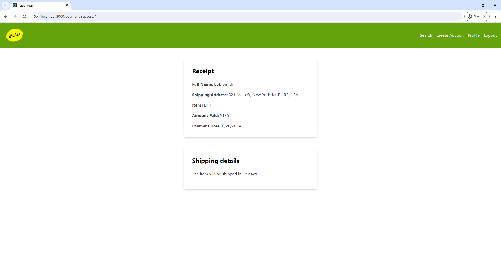

# Bidder Auction App

Bidder Auction App is a full-stack e-commerce auction platform. The application allows users to browse auctions, place bids, and manage their auction items through a user-friendly interface. The project consists of a React.js frontend and a set of Dockerized Spring Boot microservices for the backend.

## Features

- User registration and authentication
- Browse and search auction items
- Create, edit, and delete auction items
- Place bids on auction items
- Real-time auction updates
- Payment processing
- Notifications for bid status and auction outcomes
- Admin dashboard for managing auctions and users

## Screenshots

### Sign Up Page

### Log In Page

### Forgot Password Page

### Search Page

### Bidding Page

### Create Auction Page

### Auction Ended Page

### Payment Page

### Receipt Page

### Profile Page

### Admin Dashboard

## Getting Started

To get a local copy up and running, follow these steps.

### Prerequisites

- Node.js
- Docker and Docker Compose
- Java 17 or later for local development

### Installation

1. Clone the repository:

   \`\`\`bash
   git clone https://github.com/stefan-smol/bidder.git
   cd bidder
   \`\`\`

2. Follow the installation steps for the frontend and backend as described in their respective README files located in the frontend and backend directories.
